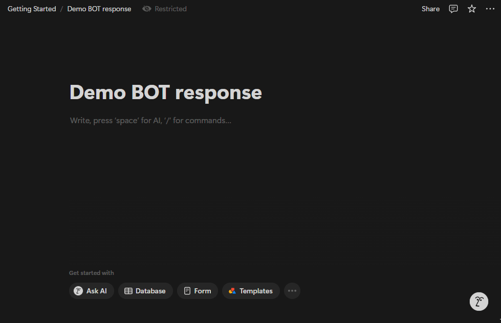

# Notion Bot Sample Project

This sample project demonstrates a Notion bot that polls a Notion page for new messages, automatically responds to them, and provides a Flask endpoint to check the bot's status.

## Features

- **Notion Integration:** Polls a specified Notion page for new messages.
- **Automatic Response:** Replies to new messages by appending a response to the page.
- **Status Endpoint:** Provides a `/status` endpoint via Flask to verify the bot is running.

## Demo


## Prerequisites

- **Python 3.6+** installed on your machine.
- A **Notion API Key**.
- A **Notion Page ID** for the page you want to monitor.

## Setup & Configuration

### 1. Clone the Repository
### 2. Install Dependencies
```
pip install -r requirements.txt
```
### 3. Configure Notion API Credentials
#### - Option A: Edit the Code Directly
Open notion.py and replace the placeholders:
```
# In notion.py
NOTION_API_KEY = "your_notion_api_key"  # Replace with your Notion API key
PAGE_ID = "your_page_id"                # Replace with your Notion page ID
```
#### - Option B: Use Environment Variables
Update notion.py to load the values from environment variables:
```
import os

NOTION_API_KEY = os.environ.get("NOTION_API_KEY", "xxxxx")
PAGE_ID = os.environ.get("PAGE_ID", "xxxxxxxx-xxxx-xxxx-xxxx-xxxxxxxxxxxx")
```
Then export the variables in your terminal:
```
export NOTION_API_KEY="your_notion_api_key"
export PAGE_ID="your_page_id"
```

## Running the Bot
To start the bot, run the notion.py script:
```
python notion.py
```
A background thread will poll your Notion page for new messages.
The Flask server will start on http://0.0.0.0:5080/.
Check the status endpoint at http://localhost:5080/status to confirm the bot is running.

## Customization
- Response & Message Prefixes: Modify the response_prefix and message_prefix variables inside the check_notion() function in notion.py to customize how messages are processed.
- Polling Frequency: Adjust the time.sleep(1) call in the polling loop to change how often the bot checks for new messages.
- Flask Port: If port 5080 is already in use, update the port in the app.run() call in notion.py.

## Troubleshooting
- API Credentials: Verify your Notion API key and page ID are correctly set.
- Network Issues: Ensure you have an active internet connection and the Notion API is accessible.
- Port Conflicts: If the Flask server fails to start, check that no other service is running on port 5080.

## Contributing
Contributions are welcome! Please fork the repository, make your changes, and submit a pull request with improvements.

## MIT License
This README provides detailed instructions on setting up, configuring, running, and customizing the Notion Bot sample project.
